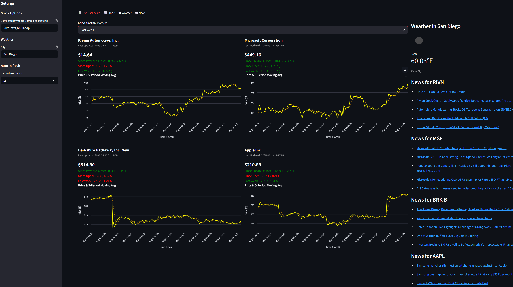

# 📈 Real-Time Stock Dashboard

A real-time stock price dashboard built with **Streamlit**, **Altair**, and a local **MCP server**.

Fetches and displays live and historical stock data with dynamic charts.
Auto-refreshes every few seconds for real-time monitoring.
---

<!-- Dashboard Screenshot -->


---

## 🚀 Features

* Real-time stock price updates via MCP server
* Interactive Altair charts
* Supports multiple timeframes:

  * Today
  * Last Week
  * Last Month
  * Last 3 Months
  * Last Year
* Local timezone adjustment for all timestamps
* Moving average smoothing (5 periods)
* Customizable refresh intervals (10s, 15s, 30s)

---

## 🛠 Project Structure

```
live-data-visualizer/
├── app.py                # Main Streamlit app
├── mcp_server/
│   └── server.py         # MCP Server for stock price fetching
├── utils/
│   └── data_fetcher.py   # Functions for MCP and yfinance data
├── tests/
│   └── test_fetcher.py   # Unit tests
├── setup_env.bat         # (Optional) Setup virtual environment
├── start_dashboard.bat   # (Optional) Start both MCP server + Streamlit app
├── requirements.txt      # Python dependencies
├── README.md             # Project overview (this file)
└── LICENSE               # MIT License
```

---

## ⚙️ Installation & Running

### 1. Clone the repository

```bash
git clone https://github.com/yourusername/live-data-visualizer.git
cd live-data-visualizer
```

---

### 2. Setup environment

Install requirements manually:

```bash
pip install -r requirements.txt
```

Or use the automatic setup script on Windows:

```bash
setup_env.bat
```

---

### 3. Start the Dashboard

Recommended: Use the start script:

```bash
start_dashboard.bat
```

Or manually:

```bash
python mcp_server/server.py
streamlit run app.py
```

## 📜 License

This project is licensed under the MIT License.

---